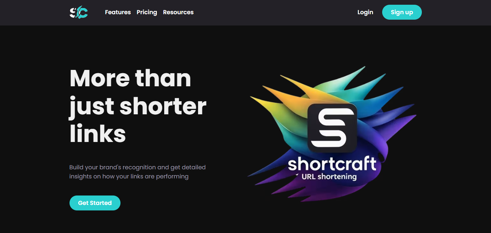
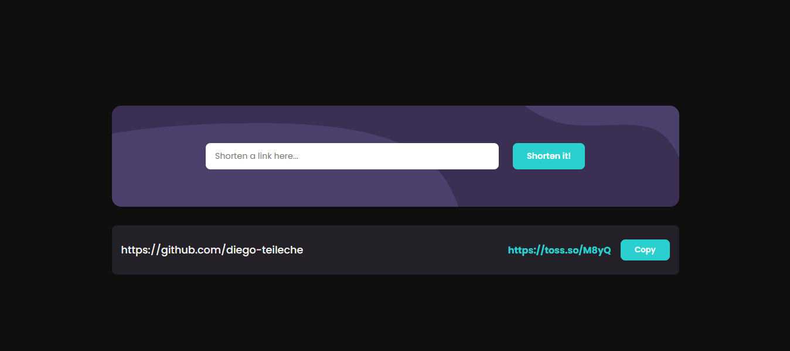
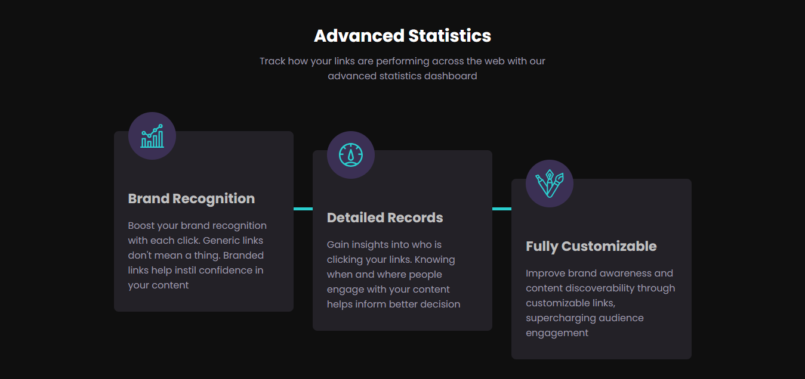
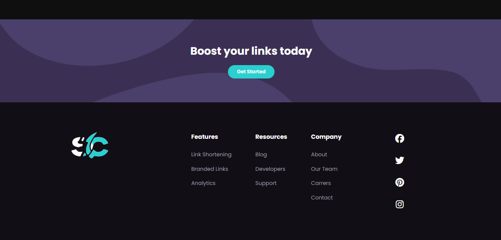

# About the App 

This is a Shortener URLs called ShortCraft built by `Diego Tech` by using:

- React.js
- TypeScript

<br />






<br />

### One Message for EveryOne 🔥

> [!TIP]
> ```shell
> Aguante Argentina!!!
> Aguante Messi!!!
> ```